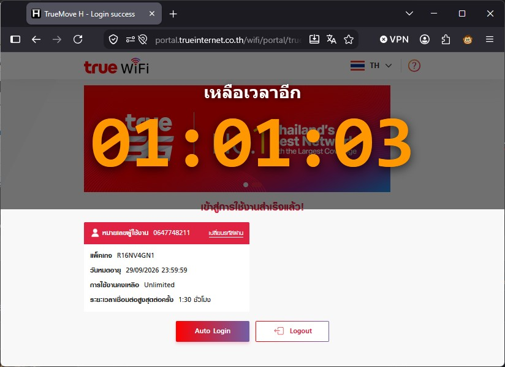
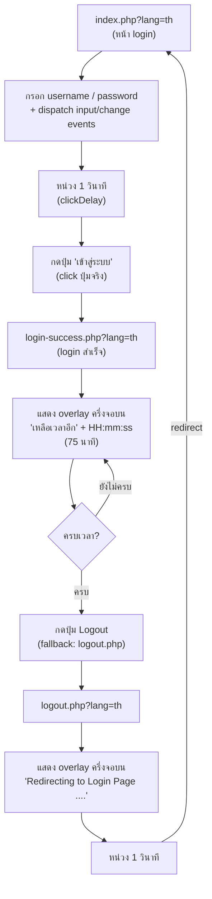

# TrueWiFi Auto Login (New Portal) — v1.0.0

> Greasemonkey / Tampermonkey userscript สำหรับ **TrueMove H (TrueWiFi) Portal ใหม่**
> กรอก username/password + กดปุ่ม "เข้าสู่ระบบ" อัตโนมัติ พร้อม **ตัวนับเวลาถอยหลัง (HH:mm:ss)** แบบ overlay ครึ่งจอบน และ **Logout อัตโนมัติ** เมื่อครบเวลา

---

## สารบัญ

- [1. คุณสมบัติ (Features)](#1-คุณสมบัติ-features)
- [2. ตัวอย่างหน้าจอ (Screenshot)](#2-ตัวอย่างหน้าจอ-screenshot)
- [3. ผังการทำงาน (Flow Diagram)](#3-ผังการทำงาน-flow-diagram)
- [4. ไฟล์ที่เกี่ยวข้อง](#4-ไฟล์ที่เกี่ยวข้อง)
- [5. การติดตั้ง Greasemonkey (Firefox)](#5-การติดตั้ง-greasemonkey-firefox)
- [6. การตั้งค่า (Configuration)](#6-การตั้งค่า-configuration)
- [7. วิธีการทำงาน (How It Works)](#7-วิธีการทำงาน-how-it-works)
- [8. การจัดเก็บข้อมูล (Storage)](#8-การจัดเก็บข้อมูล-storage)
- [9. การแก้ไขปัญหา (Troubleshooting)](#9-การแก้ไขปัญหา-troubleshooting)
- [10. ประวัติเวอร์ชัน (Changelog)](#10-ประวัติเวอร์ชัน-changelog)
- [11. ลิขสิทธิ์](#11-ลิขสิทธิ์)

---

## 1. คุณสมบัติ (Features)

| # | คุณสมบัติ | รายละเอียด |
|---|---|---|
| 1 | **Auto-fill ฟอร์ม login** | กรอก `username` / `password` อัตโนมัติบนหน้า `index.php` (ใช้ native setter + dispatch events กัน framework ไม่เห็นค่า) |
| 2 | **กดปุ่ม "เข้าสู่ระบบ" อัตโนมัติ** | หน่วงเวลา `clickDelay` (ค่าเริ่มต้น 1 วินาที) แล้ว click ปุ่มจริง (ปุ่มเป็น `type="button"` + `onclick="Validation()"` จึงต้อง click ไม่ใช่ `form.submit()`) |
| 3 | **Countdown overlay ครึ่งจอบน** | บนหน้า `login-success.php` แสดง "เหลือเวลาอีก" + ตัวเลข **HH:mm:ss** ขนาดใหญ่ (120px) ตรงกลางครึ่งจอบน |
| 4 | **ตั้งระยะเวลาใช้งานได้** | `sessionMinutes` ค่าเริ่มต้น **75 นาที** (1 ชม 15 นาที) — ตรงกับระยะเวลาเชื่อมต่อสูงสุดของแพ็กเกจ |
| 5 | **Logout อัตโนมัติ** | เมื่อครบเวลา → กดปุ่ม **Logout** อัตโนมัติ (มี fallback ไป `logout.php` ถ้าหาปุ่มไม่เจอ) |
| 6 | **หน้า logout จัดการให้** | แสดง overlay "Redirecting to Login Page ...." ครึ่งจอบน → หน่วง 1 วินาที → redirect กลับหน้า login อัตโนมัติ |
| 7 | **ทนต่อการ reload** | เก็บ deadline ใน `sessionStorage` → กด F5 กลางเซสชัน ตัวนับไม่รีเซ็ต |
| 8 | **ไม่บังการใช้งาน** | overlay เป็น `pointerEvents: none` → ครึ่งล่างของจอยังคลิกใช้งานได้ปกติ |
| 9 | **รองรับหลายตัวจัดการสคริปต์** | Tampermonkey / Violentmonkey (GM storage) + Greasemonkey 4+ (fallback `localStorage`) |
| 10 | **จำกัดเฉพาะหน้าเป้าหมาย** | ทำงานเฉพาะ 3 หน้า: `index.php`, `login-success.php`, `logout.php` (เช็คจาก `pathname` ไม่สนใจ query string) |

---

## 2. ตัวอย่างหน้าจอ (Screenshot)

**หน้า `login-success.php` — แสดง countdown overlay ครึ่งจอบน (เหลือเวลาอีก 01:01:03) พร้อมข้อมูลแพ็กเกจและปุ่ม Logout:**



> ภาพด้านบนคือผลลัพธ์การทำงานของสคริปต์: overlay ครึ่งจอบนแสดง "เหลือเวลาอีก" + ตัวเลข HH:mm:ss ขนาดใหญ่ ส่วนครึ่งล่างยังแสดงข้อมูลแพ็กเกจ (หมายเลขผู้ใช้งาน, แพ็กเกจ, วันหมดอายุ, การใช้งานคงเหลือ) และปุ่ม **Auto Login** / **Logout** ตามปกติ

---

## 3. ผังการทำงาน (Flow Diagram)



**สรุปวงจร:** `login → success (countdown) → logout → กลับมา login` วนซ้ำอัตโนมัติ

---

## 4. ไฟล์ที่เกี่ยวข้อง

```text
True_WiFi_Auto_Login_v4.0.5/
├── README.md                          ← เอกสารนี้
├── truewifi-autologin.user.js         ← สคริปต์หลัก (v1.0.0) — ใช้กับ Portal ใหม่
└── True_WiFi_Auto_Login_v4.0.5.user.js ← สคริปต์เก่า (Portal เดิม wifiauthen/web/) — ไม่เกี่ยวข้อง
```

---

## 5. การติดตั้ง Greasemonkey (Firefox)

### ขั้นตอนที่ 1 — ติดตั้งส่วนขยาย

1. เปิด Firefox → ไปที่ [addons.mozilla.org/firefox/addon/greasemonkey](https://addons.mozilla.org/firefox/addon/greasemonkey/)
2. คลิก **Add to Firefox** → **Add** → รอติดตั้งเสร็จ
3. *(ทางเลือก)* ใช้ [Tampermonkey](https://addons.mozilla.org/firefox/addon/tampermonkey/) แทนก็ได้ — สคริปต์รองรับทั้งคู่

### ขั้นตอนที่ 2 — ติดตั้งสคริปต์

**วิธีที่ 1: เปิดไฟล์โดยตรง (แนะนำ)**
1. เปิดไฟล์ `truewifi-autologin.user.js` ใน Firefox (ลากไฟล์มาที่หน้าต่าง Firefox หรือ File → Open File)
2. Greasemonkey จะแสดงหน้า **Install script** → คลิก **Install**
3. ตรวจสอบที่ **Greasemonkey Dashboard** ว่าสคริปต์ถูกเปิดใช้งาน (Enabled)

**วิธีที่ 2: คัดลอกวาง**
1. คลิกไอคอน Greasemonkey บนแถบเครื่องมือ → **New user script**
2. ลบโค้ดตัวอย่างออก แล้ววางโค้ดทั้งหมดจาก `truewifi-autologin.user.js`
3. กด **Ctrl+S** เพื่อบันทึก

### ขั้นตอนที่ 3 — ตั้งค่า username / password

1. เปิด **Greasemonkey Dashboard** → คลิกชื่อสคริปต์เพื่อแก้ไข
2. แก้ไขค่าใน `CONFIG`:

```javascript
const CONFIG = {
    username: 'YourUsername', // ← เปลี่ยนเป็นทรูไอดี / ชื่อผู้ใช้งาน (ไม่ต้องใส่ @)
    password: 'YourPassword', // ← เปลี่ยนเป็นรหัสผ่านของคุณ
    autoSubmit: true,         // true = กดปุ่ม "เข้าสู่ระบบ" อัตโนมัติ
    clickDelay: 1000,         // หน่วงเวลาก่อนกดปุ่ม (มิลลิวินาที)
    sessionMinutes: 75,       // จำนวนนาทีก่อน logout อัตโนมัติ (75 = 1 ชม 15 นาที)
};
```

3. กด **Ctrl+S** เพื่อบันทึก

### ขั้นตอนที่ 4 — ทดสอบใช้งาน

1. เชื่อมต่อ WiFi **TrueMove H** / **TrueWiFi**
2. เปิดเบราว์เซอร์ → ระบบจะ redirect ไปหน้า login
3. สคริปต์จะกรอกข้อมูล → หน่วง 1 วิ → กด "เข้าสู่ระบบ" ให้อัตโนมัติ
4. หน้า login-success จะแสดงตัวนับเวลาถอยหลังครึ่งจอบน
5. เมื่อครบเวลา → logout อัตโนมัติ → redirect กลับหน้า login

---

## 6. การตั้งค่า (Configuration)

### `CONFIG` — ตั้งค่าหลัก

| ตัวแปร | ค่าเริ่มต้น | คำอธิบาย |
|---|---|---|
| `username` | `'YourUsername'` | ทรูไอดี / ชื่อผู้ใช้งาน (ไม่ต้องใส่ @) |
| `password` | `'YourPassword'` | รหัสผ่าน |
| `autoSubmit` | `true` | `true` = กดปุ่มเข้าสู่ระบบอัตโนมัติ, `false` = กรอกให้อย่างเดียว |
| `clickDelay` | `1000` | หน่วงเวลาก่อนกดปุ่มเข้าสู่ระบบ (มิลลิวินาที) |
| `sessionMinutes` | `75` | ระยะเวลาใช้งานก่อน logout อัตโนมัติ (นาที) |

### `PAGE` — หน้าที่สคริปต์จัดการ (ไม่ควรแก้)

| ตัวแปร | pathname | หน้าที่ |
|---|---|---|
| `PAGE.login` | `/wifi/portal/truewifi/web/index.php` | หน้า login — กรอก + กดเข้าสู่ระบบ |
| `PAGE.success` | `/wifi/portal/truewifi/web/login-success.php` | หน้า login สำเร็จ — countdown + logout |
| `PAGE.logout` | `/wifi/portal/truewifi/web/logout.php` | หน้า logout — redirect กลับ login |

---

## 7. วิธีการทำงาน (How It Works)

### หน้า `index.php` (Login)

1. รอให้ฟอร์มโหลดเสร็จ (`waitForForm` — polling ทุก 300ms สูงสุด 15 วินาที)
2. อ่านค่า username/password: **GM storage → localStorage → CONFIG** (ตามลำดับ)
3. ตรวจสอบว่ายังไม่ได้ตั้งค่า (ค่าเป็น `YourUsername`/`YourPassword`) → แสดง toast เตือนแล้วหยุด
4. กรอกค่าด้วย **native setter** + dispatch `input`/`change` events (กัน framework ไม่เห็นค่า)
5. หน่วง `clickDelay` (1 วิ) → click ปุ่ม:
   - ลำดับ selector: `button.btn-primary` → `button[onclick*="Validation"]` → `form#form button[type="submit"]`
   - fallback: เรียก `Validation()` ตรง ๆ → สุดท้าย `form.submit()`

### หน้า `login-success.php` (Countdown)

1. อ่าน deadline จาก `sessionStorage` (key: `tw_session_deadline`)
   - ไม่มีค่า / หมดอายุแล้ว → ตั้งใหม่ = `Date.now() + sessionMinutes*60*1000`
   - มีค่า → นับต่อจากเวลาที่เหลือจริง (ทน reload)
2. สร้าง overlay ครึ่งจอบน (`top:0`, `height:50vh`, พื้นหลัง `rgba(0,0,0,.55)`, `pointerEvents:none`)
   - ข้อความ "เหลือเวลาอีก" (ขาว 28px หนา) + ตัวเลข **HH:mm:ss** (ส้ม 120px monospace)
3. `setInterval` ทุก 1 วินาที อัปเดตตัวเลข (format ด้วย `padStart(2,'0')`)
4. เมื่อครบเวลา: ล้าง interval → ลบ deadline + overlay → กดปุ่ม Logout:
   - selector: `button[onclick*="logout.php"]` → `button.btn-secondary`
   - fallback: `location.href = 'logout.php?lang=th'`

### หน้า `logout.php` (Redirect)

1. สร้าง overlay ครึ่งจอบน (template เดียวกับหน้า success) ข้อความ **"Redirecting to Login Page ...."**
2. หน่วง 1 วินาที → `location.href = '.../index.php?lang=th'`

---

## 8. การจัดเก็บข้อมูล (Storage)

| ระบบ | key | ใช้เก็บ | หมายเหตุ |
|---|---|---|---|
| GM storage (`GM_setValue`) | `username`, `password` | credential | Tampermonkey / Violentmonkey |
| `localStorage` | `tw_autologin_username`, `tw_autologin_password` | credential (fallback) | Greasemonkey 4+ (ไม่มี GM API แบบ sync) |
| `sessionStorage` | `tw_session_deadline` | deadline ของ countdown | ทน reload — ลบอัตโนมัติเมื่อ logout |

> **ลำดับการอ่าน:** GM storage → localStorage → CONFIG (ค่าในสคริปต์เป็นค่าเริ่มต้นสุดท้าย)

---

## 9. การแก้ไขปัญหา (Troubleshooting)

| อาการ | สาเหตุ | วิธีแก้ |
|---|---|---|
| สคริปต์ไม่ทำงานเลย | ติดตั้งไม่สำเร็จ / ยังเป็นเวอร์ชันเก่า | เปิด Greasemonkey Dashboard → ตรวจว่า Enabled + version 1.0.0 |
| ไม่เห็น countdown บนหน้า success | ใช้ VS Code browser / เบราว์เซอร์ที่ไม่มี Greasemonkey | ต้องทดสอบใน **Firefox จริง** ที่ติดตั้ง Greasemonkey |
| แจ้ง "ยังไม่ได้ตั้งค่า username/password" | ยังไม่ได้แก้ `CONFIG` | แก้ `CONFIG.username` / `CONFIG.password` แล้ว Ctrl+S |
| ตัวนับรีเซ็ตเมื่อ reload | — | ควรนับต่อได้ (sessionStorage) — ถ้ารีเซ็ต แสดงว่าเปิดแท็บใหม่ (session ใหม่) |
| กดเข้าสู่ระบบไม่สำเร็จ | รหัสผิด / ฟอร์มเปลี่ยน | ตรวจ credential + เปิด Console (F12) ดู error |
| วนลูป login → success → logout | ตั้ง `sessionMinutes` สั้นเกินไป | เพิ่ม `sessionMinutes` ให้ตรงแพ็กเกจ |
| ตรวจสอบว่าสคริปต์รันหรือไม่ | — | F12 → Console → พิมพ์ `document.getElementById('tw-countdown-overlay')` — ถ้าได้ element แปลว่ารันแล้ว |

---

## 10. ประวัติเวอร์ชัน (Changelog)

| เวอร์ชัน | วันที่ | การเปลี่ยนแปลง |
|---|---|---|
| **1.0.0** | 2026-09-10 | เวอร์ชันแรก: auto-fill + กดเข้าสู่ระบบ, countdown 75 นาที (HH:mm:ss) ครึ่งจอบน, logout อัตโนมัติ, redirect กลับหน้า login, รองรับ Tampermonkey/Violentmonkey/Greasemonkey 4+ |

---

## 11. ลิขสิทธิ์

- **ผู้พัฒนา:** Wachira Duangdee ([github.com/wachira90](https://github.com/wachira90))
- สคริปต์นี้จัดทำเพื่อใช้งานส่วนตัวกับเครือข่าย TrueMove H (TrueWiFi) — ใช้ตามความรับผิดชอบของคุณเอง
- อย่าลืมว่า credential ถูกเก็บในเครื่องของคุณเท่านั้น (GM storage / localStorage) ไม่มีการส่งข้อมูลไปที่อื่นนอกจาก portal ของ True