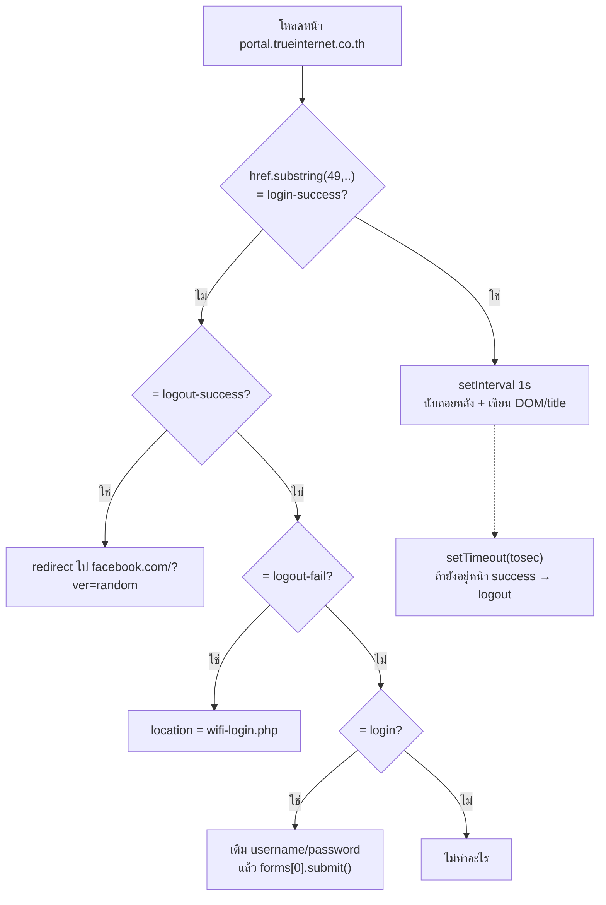

# True WiFi Auto Login/Logout — v4.0.5

> รายงานการสำรวจและวิเคราะห์โค้ด (Code Review Report)
> ไฟล์เป้าหมาย: `True_WiFi_Auto_Login_v4.0.5.user.js`

---

## สารบัญ

- [1. ภาพรวมไฟล์](#1-ภาพรวมไฟล์)
- [2. การทำงาน (Flow)](#2-การทำงาน-flow)
- [3. จุดที่ทำงานถูกต้อง](#3-จุดที่ทำงานถูกต้อง-ยืนยันด้วยการคำนวณจริง)
- [4. ปัญหาและบั๊ก](#4-ปัญหาและบั๊ก-เรียงตามความรุนแรง)
- [5. ความปลอดภัย](#5-ความปลอดภัย)
- [6. สรุปคำแนะนำ](#6-สรุปคำแนะนำ-ตามลำดับที่ควรทำ)

---

## 1. ภาพรวมไฟล์

Workspace นี้มีโค้ดเพียงไฟล์เดียว คือ userscript `True_WiFi_Auto_Login_v4.0.5.user.js` ไม่มีไฟล์อื่นแอบซ่อน

```text
True_WiFi_Auto_Login_v4.0.5/
├── README.md                              (รายงานการวิเคราะห์นี้)
└── True_WiFi_Auto_Login_v4.0.5.user.js    (87 บรรทัด, 3,804 bytes)
```

| รายการ | ค่า |
|---|---|
| ไฟล์ | `True_WiFi_Auto_Login_v4.0.5.user.js` |
| ขนาด / บรรทัด | 3,804 bytes / **87 บรรทัด** |
| Encoding | UTF-8 **ไม่มี BOM** (ขึ้นต้น `2F 2F 20 3D` = `// =`) |
| Metadata ที่มี | `@name`, `@version`, `@author`, `@namespace`, `@description`, `@include` |
| Metadata ที่ขาด | `@match`, `@grant`, `@run-at`, `@noframes`, `@license`, `@updateURL` |
| โครงสร้างโค้ด | ไม่มีฟังก์ชันเลย — เป็น top-level script 4 บล็อก (Credential → Variables → Show Time → Timer) |

---

## 2. การทำงาน (Flow)



---

## 3. จุดที่ทำงานถูกต้อง (ยืนยันด้วยการคำนวณจริง)

- Prefix `https://portal.trueinternet.co.th/wifiauthen/web/` ยาว **49 ตัวอักษรพอดี** → offset ทั้ง 8 ตัว (`49,71` / `49,68` / `49,72` / `49,69` / `49,66` / `49,63` / `49,60`) ตรงกับชื่อไฟล์ปลายทางทั้งหมด **ไม่มี off-by-one**

| ไฟล์ปลายทาง | ความยาว | ช่วง substring ที่ใช้ |
|---|---|---|
| `wifi-login-success.php` | 22 | `substring(49, 71)` |
| `7-login-success.php` | 19 | `substring(49, 68)` |
| `wifi-logout-success.php` | 23 | `substring(49, 72)` |
| `7-logout-success.php` | 20 | `substring(49, 69)` |
| `wifi-logout-fail.php` | 20 | `substring(49, 69)` |
| `7-logout-fail.php` | 17 | `substring(49, 66)` |
| `wifi-login.php` | 14 | `substring(49, 63)` |
| `7-login.php` | 11 | `substring(49, 60)` |

- ไม่มี false-positive ระหว่างคู่ `wifi-*` กับ `7-*` เพราะเลือก end index ตามความยาวจริงของแต่ละชื่อ
- ลำดับ `if/else if` ถูกต้อง — เช็คชื่อเต็มก่อนชื่อ 7-11

---

## 4. ปัญหาและบั๊ก (เรียงตามความรุนแรง)

### 🔴 1. Magic number 49 — เปราะและพังเงียบ (พิสูจน์แล้ว)

ถ้าหน้าเป็น `http://` prefix จะเหลือ 48 ตัว → `substring(49, 63)` เรียกบนสตริงยาว 62 จะ **throw `IndexSizeError`/คืนค่าว่าง** → ทุกสาขาไม่ match → สคริปต์ไม่ทำงานเลยโดยไม่มี error ให้เห็น

และถ้า portal ย้าย path (เช่นเพิ่ม `/web/v2/`) ก็จบทั้งไฟล์

> **ควรใช้** `new URL(location.href).pathname.split('/').pop()` หรือ `href.endsWith(url_login)`

### 🔴 2. ไม่มี null guard เลย

`getElementById('username')`, `getElementById('wifi_bottom_bg')`, `forms[0]` — ถ้า element ยังไม่มา/ถูกเปลี่ยน id จะได้ `TypeError` แล้วสคริปต์ตายทั้งตัว

และ `forms[0]` คือ "ฟอร์มแรกของหน้า" ซึ่งไม่การันตีว่าเป็นฟอร์ม login

### 🔴 3. ตัวนับเวลาไม่ทน reload และเพี้ยน

- `tosec` / `cooldown` เป็นค่าคงที่ที่คำนวณใหม่ทุกครั้งที่โหลดสคริปต์ → กด F5 กลางเซสชัน = นับใหม่จาก `minute` เต็ม (logout ช้ากว่าความจริง)
- `cooldown--` ไม่มี clamp → ถ้าไม่ navigate จะไหลเป็น `Time left -0:-1:-1`
- `setInterval` ลบ 1 ทุก ~1000ms = **drift สะสม**, ไม่มี `clearInterval`
- `parseInt` ตัดทศนิยม, ไม่ pad เลข 0 → แสดง `2:58:0` แทน `02:58:00`

### 🟠 4. Timer ทำงานเฉพาะเมื่อยังอยู่หน้า success

ถ้าผู้ใช้เปลี่ยนแท็บ/ไปหน้าอื่นตอนหมดเวลา → **ไม่ logout เลย** เซสชันค้าง และไม่มี guard กันการ logout ซ้ำ

### 🟠 5. Redirect เป็น relative

`document.location = url_login` resolve กับ directory ปัจจุบัน (ตอนนี้ได้ผลเพราะ fail page อยู่ `/web/` เหมือนกัน) แต่ถ้าย้ายโฟลเดอร์จะพาไปผิดที่

### 🟠 6. หน้านี้ไม่ถูกจัดการ

`url_logout` = `.../wifiauthen/logout_result.php` (prefix 45 ตัว, ยาวรวม 62) อยู่นอกตระกูล `/web/` และไม่มีสาขาตรวจ → สคริปต์เงียบบนหน้านั้น

### 🟡 7. เสี่ยงวนลูป

fail → login → submit → fail → … ไม่มี retry limit/backoff และ `forms[0].submit()` ยังข้าม `onsubmit` handler ของหน้าเว็บ

---

## 5. ความปลอดภัย

| ระดับ | ประเด็น |
|---|---|
| 🔴 | **รหัสผ่าน plain text ในไฟล์** — ใครได้ไฟล์ได้รหัสทันที (ควรใช้ `GM_setValue` หรือ prompt ครั้งแรก) |
| 🔴 | โค้ดเป็น **top-level global** ไม่มี IIFE → `window.password` มองเห็นได้จากสคริปต์อื่นบนหน้าเว็บเดียวกัน |
| 🟠 | `@include http*://` ยอมรับ `http://` → ไม่บังคับ TLS ทั้งที่ส่ง credential ผ่าน captive portal (เสี่ยง MITM) ควรล็อกเป็น `https://` |
| 🟠 | `url_to_redirect` ชี้ `http://www.facebook.com/?ver=` — ไม่เข้ารหัส, hardcode, ปรับไม่ได้ |
| 🟡 | ไม่มี `@noframes` → ถ้า portal ฝัง iframe อาจ submit/วนซ้ำ |

---

## 6. สรุปคำแนะนำ (ตามลำดับที่ควรทำ)

1. **เลิกใช้ `substring(49,..)`** → ใช้ `pathname` ตัดชื่อไฟล์ แล้วเทียบด้วย `endsWith` หรือ map object แทน if-else chain
2. **ห่อทุกอย่างใน IIFE** `(function(){ 'use strict'; ... })();` และย้าย credential ออกจากตัวไฟล์
3. **เก็บ deadline จริงด้วย `Date.now()`** + `sessionStorage`/`GM_setValue` → countdown ทน reload และไม่ drift
4. **ใส่ null guard / `try-catch`** + ตั้ง `@run-at document-idle` และอ่าน element ให้ครบก่อน submit
5. **ล็อก URL เป็น `https://` ทั้งหมด**, เพิ่ม `@match`, `@grant`, `@noframes`
6. **จัด format เวลาเป็น `HH:MM:SS`** และ clamp ที่ 0

---

## ภาคผนวก: ตัวอย่างโค้ดที่แนะนำ

### ตรวจ URL แบบปลอดภัย (แทน magic number 49)

```javascript
const page = new URL(location.href).pathname.split('/').pop();

const ROUTES = {
  'wifi-login.php':          'login',
  '7-login.php':             'login',
  'wifi-login-success.php':  'success',
  '7-login-success.php':     'success',
  'wifi-logout-success.php': 'logout-success',
  '7-logout-success.php':    'logout-success',
  'wifi-logout-fail.php':    'logout-fail',
  '7-logout-fail.php':       'logout-fail',
};
```

### Countdown ที่ไม่ drift และทน reload

```javascript
const deadline = Number(sessionStorage.getItem('truewifi_deadline'))
  || Date.now() + minute * 60 * 1000;
sessionStorage.setItem('truewifi_deadline', String(deadline));

setInterval(() => {
  const left = Math.max(0, deadline - Date.now());
  const total = Math.floor(left / 1000);
  const h = String(Math.floor(total / 3600)).padStart(2, '0');
  const m = String(Math.floor(total / 60) % 60).padStart(2, '0');
  const s = String(total % 60).padStart(2, '0');
  // ...อัปเดต DOM / title
}, 1000);
```

---

## สรุปสถานะโค้ด

| หัวข้อ | สถานะ |
|---|---|
| ตรรกะการตรวจ URL | ⚠️ ถูกต้องแต่เปราะ (พึ่ง offset 49) |
| การจัดการ error | ❌ ไม่มีเลย |
| ความทนทานต่อ reload | ❌ ไม่มี |
| ความแม่นยำของตัวนับเวลา | ⚠️ มี drift + ค่าไม่ถูก clamp |
| ความปลอดภัยของ credential | ❌ plain text + global scope |
| Metadata ของ userscript | ⚠️ ขาด `@grant` / `@run-at` / `@noframes` |

> **สรุป:** สคริปต์ทำงานได้ในสภาพแวดล้อมปัจจุบัน (HTTPS + path เดิม) แต่เปราะต่อการเปลี่ยนแปลงใด ๆ ของ portal, ไม่มี error handling, นับเวลาเพี้ยนเมื่อ reload และเก็บรหัสผ่านแบบ plain text
